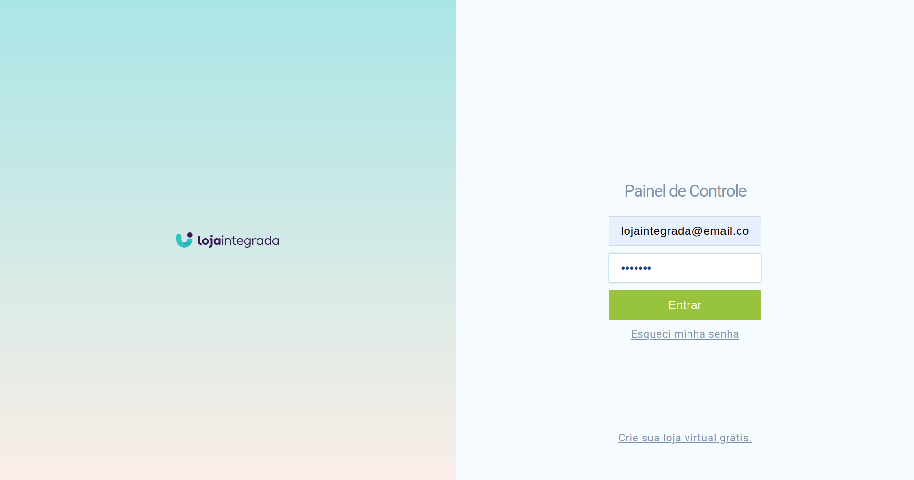
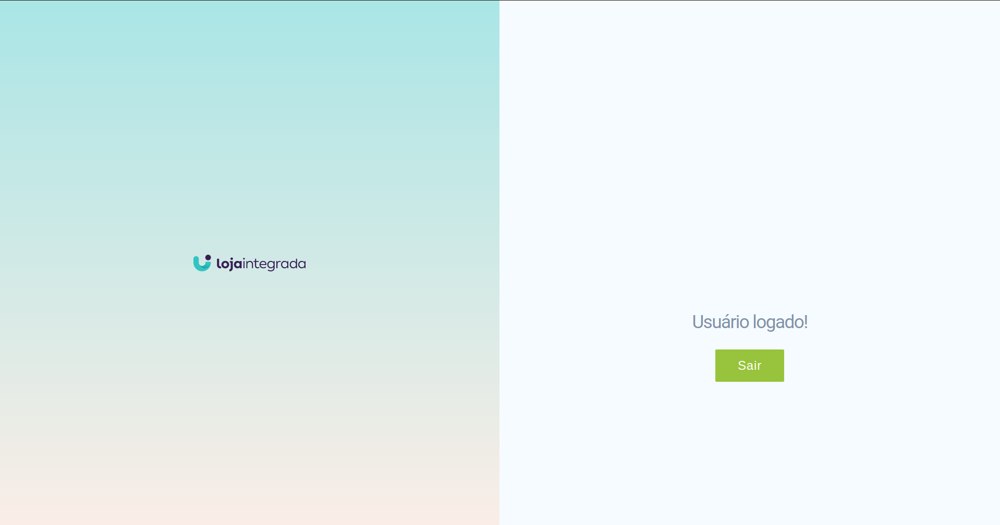
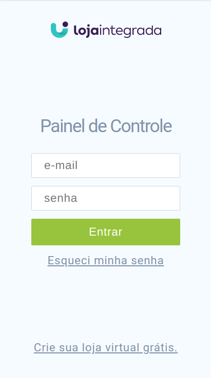
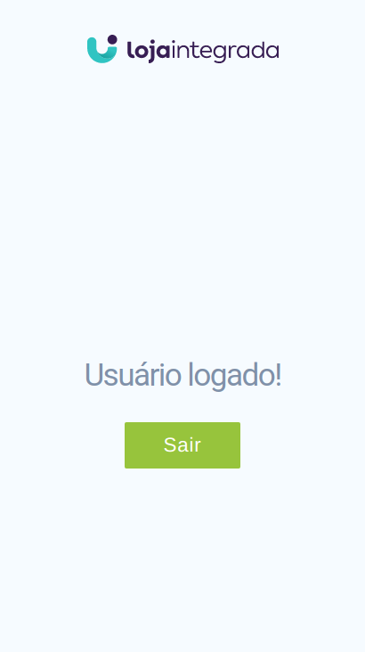

# Case_Loja_integrada

## Sobre ℹ️

O projeto é uma página de login para uma aplicação web.

## Priorização

● Design deve ser responsivo [1]

Por ser o primeiro contato do usuário com o sistema, o design responsivo oferece uma boa experiência de navegação além de ter usabilidade, ser intuitiva e simples de usar.

● Formulário deve conter validações [2]

É de extrema importância verificar se os dados informados são válidos para manter a consistência dos dados inseridos, além de orientar o usuário sobre quais tipos de dados inserir no sistema.

● Formulário devem possuir acessibilidade [3]

Não apenas o formulário mas toda a aplicação. Tanto na questão de leitura de tela, quanto na navegação com o teclado e posicionamento de componentes.

● Back-end que retorne erro ou sucesso ao logar [4]

Neste caso é necessário o retorno do backend para gerenciar o comportamento de alguns componentes da aplicação.

● Exibir retornos/alertas de sucesso ou erro de login[5]

O retorno do status das ações do usuário no sistema impactam diretamente na experiência do usuário e auxiliam o mesmo em decidir quais ações tomar após os retornos.

● Contabilizar tentativas de login malsucedidas e impedir de continuar caso
passe do limite estabelecido[6]

Funcionalidade não implementada

● Faça a API ser em GraphQL[7]

Funcionalidade não implementada devido a complexidade alta quando comparado aos outros tópicos desse desafio.

● Transforme a aplicação em um Progressive Web App [8]

Funcionalidade não implementada

## 📷 Screenshots

Retorno da execução do projeto.





Versão responsiva





## ⚙️ Instalação

**Linguagem**: 🐍 Python e JS<br>

### Para distribuição Linux 🐧 :

**Para a execução do projeto é necessário a instalação previa do docker e docker-compose.**

1. [Clone](https://help.github.com/en/articles/cloning-a-repository) o repositório do projeto. Para clonar vá ao terminal e digite:

```
$ git clone git@github.com:FabianaRibas/Case_Loja_integrada.git
```

2. Entre na pasta do projeto:

```
$ cd Case_Loja_integrada
```

3. Para compilar o projeto, execute o comando do docker:

```
$ docker-compose up --build
```

4. Depois de realizar todos esses passos, aproveite o projeto e divirta-se!

## 💻 Uso

Utilize a rota http://localhost:3000/ para logar na aplicação. Após logar com sucesso você será redirecionado para a rota http://localhost:3000/home
